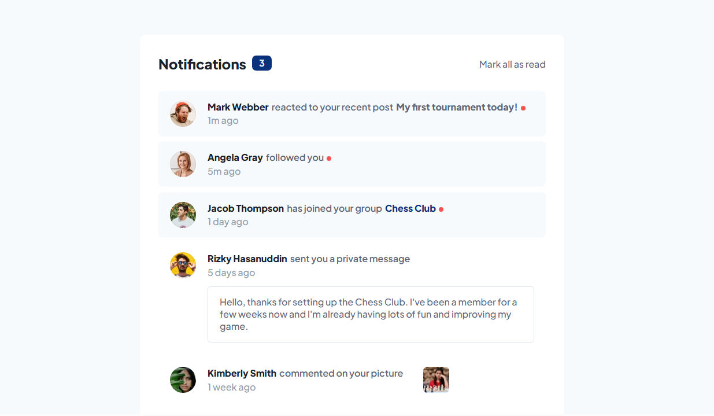
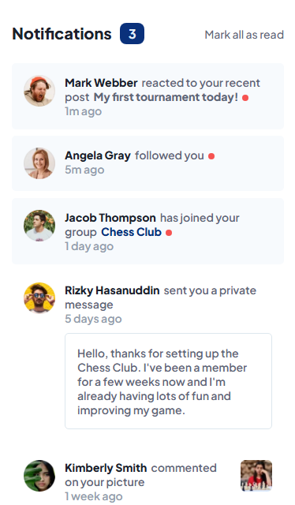

# Frontend Mentor - Notifications page solution

This is a solution to the [Notifications page challenge on Frontend Mentor](https://www.frontendmentor.io/challenges/notifications-page-DqK5QAmKbC). Frontend Mentor challenges help you improve your coding skills by building realistic projects. 

## Table of contents

- [Overview](#overview)
  - [The challenge](#the-challenge)
  - [Screenshot](#screenshot)
  - [Links](#links)
- [My process](#my-process)
  - [Built with](#built-with)
  - [What I learned](#what-i-learned)
  - [Continued development](#continued-development)
- [Author](#author)

## Overview

### The challenge

Users should be able to:

- Distinguish between "unread" and "read" notifications
- Select "Mark all as read" to toggle the visual state of the unread notifications and set the number of unread messages to zero
- View the optimal layout for the interface depending on their device's screen size
- See hover and focus states for all interactive elements on the page

### Screenshot

### Links

- Solution URL: [Add solution URL here](https://your-solution-url.com)
- Live Site URL: [https://mateusrissodiblasio.github.io/notifications-page](https://mateusrissodiblasio.github.io/notifications-page)

## My process

### Built with

- Semantic HTML5 markup
- CSS custom properties
- Flexbox
- Mobile-first workflow

### What I learned

Exploring styling multiple interactive elements and changing "unread" notifications visual after a click, something usual for anyone on their daily use apps.

### Continued development

Notifications examples are good learn how the majority of apps take care of status of some visual alerts for users , leading the user to take a look on what is important for them as it can be important to the app show them.

## Author

- Website - [Mateus Risso Di Blasio](https://github.com/MateusRissoDiBlasio)
- Frontend Mentor - [@MateusRissoDiBlasio](https://www.frontendmentor.io/profile/MateusRissoDiBlasio)